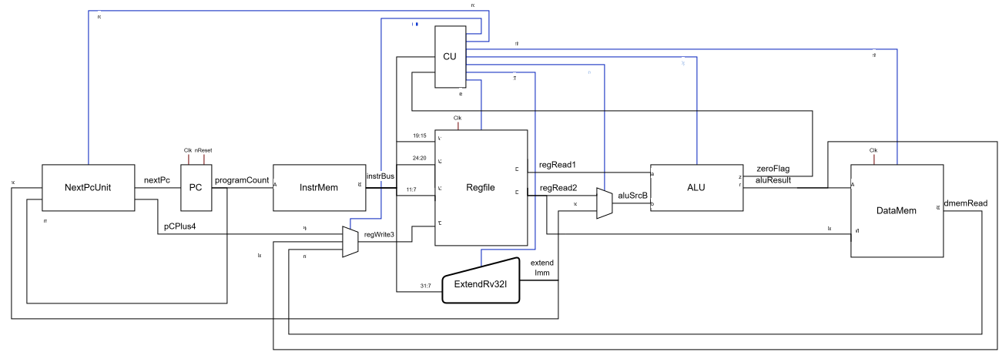
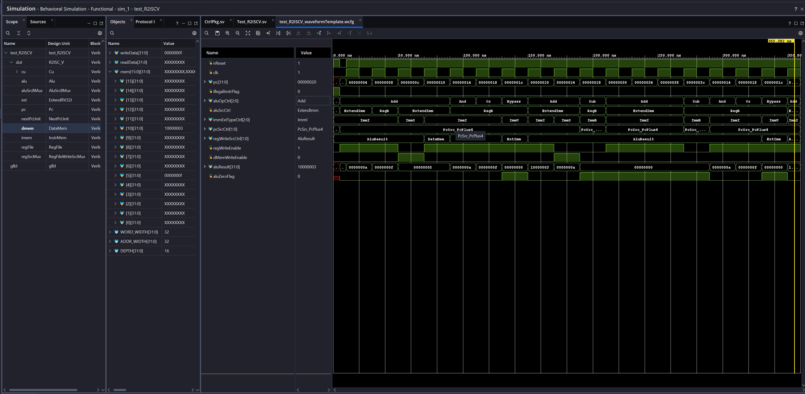

# R²ISC-V

RSquaredISC-V is a cut down, single cycle core that implements part of the **RV32I** ISA, which iterates on R³ISC-V. It incorporates more instructions than R³ISC-V and will eventually feature MMIO, making it suitable for synthesis as well as simulation.
 
---

## Features

- Single cycle datapath
- Clock prescaler
- Combinational ALU, CU and immediate generation
- 32 word instruction memory
- 16 word data memory
- Illegal instruction flag 

R²ISC-V uses a single cycle architecture, where each stage of the execution of an instruction occurs within a single clock cycle. Control signals are generated combinationally by the CU featuring an opcode decoder and a decoder for the ALU. It features basic illegal state detection, "handling" them by halting the CPU - this hasn't been tested yet. A prescaler is included to make the operation of the CPU observable by people when synthesised.
 
## Supported instructions

| Mnemonic | Type  | Description                          | Operation                   |
|----------|-------|--------------------------------------|-----------------------------|
| `LW`     | I-type| Load word from memory                | rd = mem[address]           |
| `SW`     | S-type| Store word to memory                 | mem[address] = rs2          |
| `ADD`    | R-type| Add two registers                    | rd = rs1 + rs2              |
| `AND`    | R-type| Bitwise AND between two registers    | rd = rs1 & rs2              |
| `OR`     | R-type| Bitwise OR between two registers     | rd = rs1 \| rs2             |
| `ADDI`   | I-type| Add register and immediate           | rd = rs1 + SE(imm)          |
| `BEQ`    | B-type| Branch if two registers are equal    | if (rs1 == rs2) PC = BTA    |
| `LUI`    | U-type| Load upper immediate into registers  | rd = {uimm, 12'b0}

### Key

| Term           | Meaning                                 |
|----------------|-----------------------------------------|
| `SE(imm)`      | Sign‑extended immediate                 |
| `mem[address]` | Memory word at the address              |
| `BTA`          | Branch target address (PC + offset)     |
| `PC`           | Program counter                         |
| `uimm`         | Upper immediate                         |

---

## Structural diagram

A diagram showing the structure of R³ISC-V from which R²ISC-V was developed

**[Outdated]** - a revised diagram will be included after future development


---

## Test program

The following program uses each of the supported instructions to demonstrate functionality and is found in [instrMem.hex](Sources/instrMem.hex). It was assembled by hand - longer programs would benefit from a future assembler project (I really ought to write an assembler). It is loaded into the instruction memory using $readmemh().

```text
// Test Program: tests every instruction, definitely not exhaustive

00500093 // ADDI x1, x0, 5 
00A00113 // ADDI x2, x0, 10
002081B3 // ADD  x3, x1, x2
0030A023 // SW   x3, 0(x1)
0000A283 // LW   x5, 0(x1)
0021F333 // AND  x6, x3, x5
0021E3B3 // OR   x7, x3, x5
10000437 // LUI  x8, 0x10000 ; Loads 0x10000000
00340413 // ADDI x8, x8, 3
00812023 // SW   x8, 0(x2)
00000463 // BEQ  x0, x0, +8
00000013 // ADDI x0, x0, 0   ; NOP
00000013 // ADDI x0, x0, 0   ; NOP
00000013 // ADDI x0, x0, 0   ; NOP
00000013 // ADDI x0, x0, 0   ; NOP
FC000CE3 // BEQ  x0, x0, -40
00000013 // ADDI x0, x0, 0  ; NOP
00000013 // ADDI x0, x0, 0  ; NOP
00000013 // ADDI x0, x0, 0  ; NOP

```

## Simulation instructions

Behavioural simulation is useful to understand the operation of the CPU at a design level.

### Simulating in vivado

1. Open Vivado and create a new project. Add [Sources](Sources) as design sources. Add the [testbench](Test/Test_R2ISCV.sv) as a simulation source.

2. From **Flow Navigator -> Simulation -> Run Simulation**, run behavioural simulation.
The console will output the contents of the instruction memory. If it has not been populated correctly (all entries are 32'b0xx... or similar), a direct path can be passed to readmemh() in [instrMem.hex](Sources/instrMem.hex) as a workaround.

3. Navigate to the waveform window, usually labeled as **Untitled** at first, to inspect the state of the components of the CPU during simulation. Different objects can be added to the waveform display. See below for an example.



---

## Progression plan

- Implement more of **RV32I**
- Write a simple assembler
- Add MMIO

---

## Acknowledgements

This project was designed using principles learned in Harris and Harris' *Digital Design and Computer Architecture - RISC-V Edition (2022)*. The structure of this CPU is based on the single cycle CPU from this textbook though its implementation is my own.
